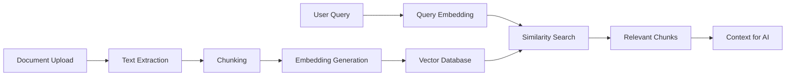

My query at Phase 5 :I think we should be careful about implementing this feature of Knowledge base. Since this is the backone truth for the AI to reference, we should also take embedding processing, store and how to provide context to the AI as well. Can you help me brainstorm? Maybe we should move everything knowledge base to Phase 8: Advanced AI Features?

Claude Answer:

You're absolutely right! The Knowledge Base is indeed the backbone for AI context and requires careful implementation. Let's brainstorm the proper architecture:

## Knowledge Base Architecture Considerations

### 1. **Current Simple Approach (Phase 5)**

Just store documents as text - **Limited but quick to implement**

python

```python
# Current: Simple text storage
KnowledgeDocument(content="raw text")
→ AI gets full text in prompt (token limit issues!)
```

### 2. **Proper Knowledge Base Architecture (Phase 8)**

mermaid



### Key Components Needed:

#### **1. Text Processing Pipeline**

python

```python
# Chunking strategies
- Sentence-based chunking
- Paragraph-based chunking  
- Semantic chunking (by topic)
- Token-aware chunking (respecting model limits)

# Metadata extraction
- Document source
- Page numbers
- Headers/sections
- Timestamps
```

#### **2. Embedding System**

python

```python
# Options:
1. OpenAI Embeddings (text-embedding-ada-002)
- Pros: Easy, integrated with GPT
- Cons: Cost, API dependency

2. Open-source (Sentence Transformers)
- Pros: Free, local
- Cons: Need GPU for speed

3. Cohere/Anthropic embeddings
- Pros: Good quality
- Cons: Another API dependency
```

#### **3. Vector Storage**

python

```python
# Options:
1. PostgreSQL + pgvector
- Pros: Already using Postgres
- Cons: Limited vector operations

2. Pinecone
- Pros: Managed, scalable
- Cons: Cost, external dependency

3. Qdrant/Weaviate
- Pros: Self-hosted, full-featured
- Cons: Another service to manage

4. ChromaDB
- Pros: Simple, Python-native
- Cons: Not production-ready
```

#### **4. Retrieval Strategy**

python

```python
# RAG (Retrieval Augmented Generation) Pipeline:
1. Query → Embedding
2. Vector similarity search (cosine/dot product)
3. Hybrid search (vector + keyword)
4. Re-ranking results
5. Context window management
```

## Proposed Implementation Plan

### **Phase 5 (Current) - Simple Knowledge Base**

Keep it simple for now:

python

```python
classKnowledgeDocument(models.Model):
# Current implementation
    content = models.TextField()
  
defget_context_for_query(self, query):
# Simple: Return first 2000 tokens
return self.content[:2000]
```

**Features:**

* ✅ File upload UI
* ✅ Document management
* ✅ Basic text extraction
* ❌ No embeddings
* ❌ No intelligent retrieval

### **Phase 8 - Advanced Knowledge Base**

Full implementation:

python

```python
classKnowledgeChunk(models.Model):
    document = models.ForeignKey(KnowledgeDocument)
    content = models.TextField()
    embedding = models.JSONField()# Or use pgvector
    metadata = models.JSONField()
  
classKnowledgeRetriever:
defretrieve(self, query, top_k=5):
# 1. Generate query embedding
        query_embedding = generate_embedding(query)
      
# 2. Vector search
        results = vector_search(query_embedding, top_k)
      
# 3. Re-rank by relevance
        reranked = rerank_results(query, results)
      
# 4. Return context
return format_context(reranked)
```

## Recommendation: Phased Approach

### **Phase 5 (Now) - Basic Storage**

python

```python
# Simple implementation
defget_agent_context(agent, user_message):
# Just concatenate all documents (with token limit)
    docs = agent.knowledge_documents.all()
    context =""
for doc in docs:
iflen(context)+len(doc.content)<2000:
            context +=f"\n---\n{doc.title}:\n{doc.content[:500]}"
return context
```

**Implement now:**

* Upload UI ✅
* Document storage ✅
* Basic text in prompts
* Token limit management

### **Phase 8 - Intelligent RAG**

**Implement later:**

* Embeddings generation
* Vector database (pgvector)
* Semantic search
* Dynamic context selection
* Chunk management
* Relevance scoring

## Migration Path

python

```python
# Phase 5 → Phase 8 Migration
classMigration:
defupgrade_to_embeddings(self):
# 1. Install pgvector
# 2. Add embedding columns
# 3. Generate embeddings for existing docs
# 4. Update retrieval logic
pass
```

## Quick Win for Phase 5

Let's implement a simple but effective approach now:

python

```python
# backend/apps/agents/services.py
classSimpleKnowledgeService:
@staticmethod
defget_context(agent, query, max_tokens=1500):
"""Simple context retrieval without embeddings"""
        documents = agent.knowledge_documents.filter(
            is_processed=True
).order_by('-uploaded_at')
      
        context_parts =[]
        token_count =0
      
for doc in documents:
# Simple keyword matching
ifany(word in doc.content.lower() 
for word in query.lower().split()):
# Add most relevant parts
                snippet = doc.content[:500]
                context_parts.append(f"[{doc.title}]: {snippet}")
                token_count +=len(snippet.split())
              
if token_count > max_tokens:
break
      
return"\n\n".join(context_parts)
```

## Decision Points

**Should we:**

1. **Option A** : Implement basic knowledge storage now (Phase 5), upgrade to embeddings later (Phase 8)?

* ✅ Quick to ship
* ✅ Provides immediate value
* ✅ Can migrate later
* ❌ Limited context quality

1. **Option B** : Skip knowledge base in Phase 5, do it properly in Phase 8?

* ✅ Better architecture from start
* ✅ No migration needed
* ❌ Delays feature availability
* ❌ More complex

1. **Option C** : Use a third-party service now (like LangChain + Pinecone)?

* ✅ Fast implementation
* ✅ Production-ready
* ❌ External dependencies
* ❌ Additional costs

**My Recommendation:** **Option A** - Implement basic storage now, with a clear upgrade path to embeddings in Phase 8. This gives immediate value while keeping the door open for improvements.

What's your preference? Should we:

1. Implement the simple version now?
2. Skip it entirely until Phase 8?
3. Use an external service?
